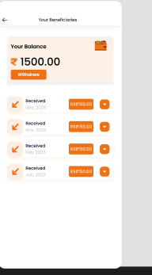

# Civic Issue Reporting & Tracking System 🚨🗺️

## 📋 Overview
Comprehensive web platform for citizens to **report civic issues** (potholes, streetlights, garbage, waterlogging) with **real-time map tracking**. Authorities can assign, update status, and monitor SLAs.

[](build/web/uploads/photos/b83ce4f9-ab90-4086-8d79-9d6e02a7730c.png)
*Public Issue Map — Color-coded by status (Nagpur demo)*

## 🚀 Features
- **Public Map** (`/map`) — Leaflet-powered map showing all issues with status colors
- **Multi-photo Issue Reporting** — GPS location + up to 3 photos + categories
- **Status Workflow** — OPEN → ASSIGNED → IN_PROGRESS → RESOLVED → CLOSED
- **User Roles** — Citizen, Admin, Crew
- **Comments & Ratings** on issues
- **CSV Export** for data analysis
- **SLA Monitoring** — Auto-status updates
- **Responsive Design** — Bootstrap 5 + mobile-first

## 🛠 Tech Stack
```
Backend: Java 8, Servlets 3.1, JDBC
Frontend: JSP 2.3, Bootstrap 5.3, JSTL 1.2, Leaflet 1.9
Database: MySQL 8.0
Security: BCrypt, CSRF tokens
Server: Apache Tomcat 8+
IDE: NetBeans 12+
```

## ⚡ Quick Start
1. **Clone & Open** in NetBeans
2. **Database:** 
   ```sql
   CREATE DATABASE civic_issues_db;
   -- Run database/schema.sql
   ```
3. **Config:** Update `DBConnection.java` password (line ~20)
4. **Run:** Clean & Build → Run Project
5. **Access:**
   ```
   🗺️  Public Map: http://localhost:8080/Civic-Issue-Reporting-Tracking-System/map
   🔐 Login: /login  (admin/admin)
   📱 Report Issue: /citizen/reportIssue (login required)
   📊 Dashboard: /citizen/dashboard
   ```

**Demo Accounts:**
```
admin@city.gov | Password: admin (Admin role)
citizen123 | Password: 123456 (Citizen)
```

## 📁 Project Structure
```
src/java/com/civicissues/
├── controller/     # All servlets (@WebServlet)
├── dao/            # IssueDAO.java, UserDAO.java
├── model/          # Issue.java, User.java
└── util/           # DBConnection.java, BCryptUtil.java

web/WEB-INF/
├── views/          # JSP templates
├── lib/            # jstl-1.2.jar, mysql-connector
└── web.xml         # Servlet config
```

## 🌐 API Endpoints
```
GET  /map                    → Public issue map
GET  /login                  → Login page
POST /login                  → Authenticate
POST /register               → User signup
POST /citizen/reportIssue    → Create issue w/ photos
GET  /citizen/dashboard      → User issues
POST /admin/updatestatus     → Change issue status
POST /comment                → Add comment
POST /rating                 → Rate resolution
GET  /admin/exportcsv        → Download CSV
```

## 📸 Screenshots
**Add your screenshots here:**
```

 

```
*Suggestion: Take screenshots of /map, report form, dashboard → Save in `/screenshots/` folder*

## 🐛 Troubleshooting
| Issue | Solution |
|-------|----------|
| 404 on /map | Check project name in browser URL |
| DB errors | Verify `civic_issues_db` exists, password in DBConnection.java |
| Photos not uploading | Check `uploads/photos/` permissions |
| Map blank | Verify internet (Leaflet CDN), GPS data in DB |

## 🔄 Development
```bash
# NetBeans: Right-click → Clean & Build → Run
# Or Tomcat: Copy build/web/ → webapps/
```

## 📄 License
MIT License — Free to use, modify, distribute.

---

**⭐ Star if useful!** Contributions welcome via PRs.
